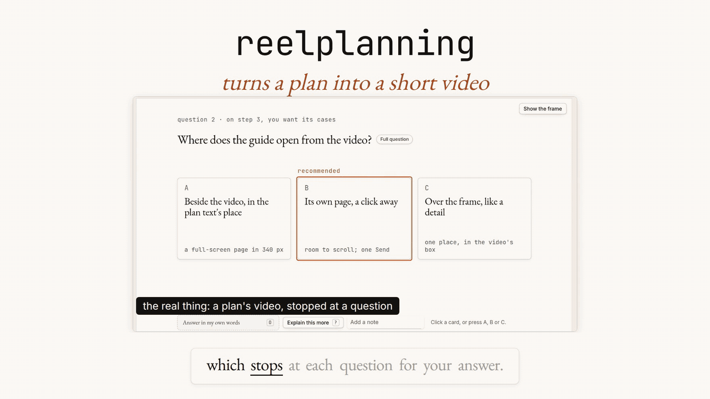
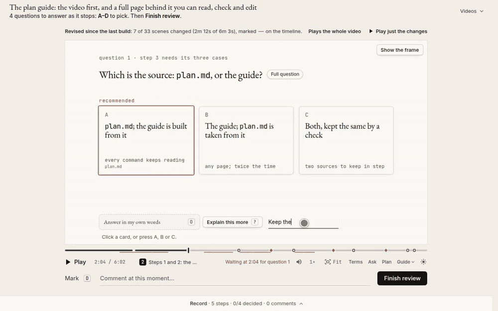

<h1 align="center">🎬 reelplanner</h1>

<p align="center"><b>Review your coding agent's plans by watching them, not reading them.</b></p>

Your agent turns its plan into a short narrated video that stops at each open choice and asks you.
You answer on the video, and the agent updates the plan.



**Works with:** Claude Code (tested) · Codex (basic support) · GitHub Copilot, Cursor, OpenCode, Antigravity CLI
(untested: [what each needs](./docs/agents.md))

## Before you try

- macOS (Homebrew) or Linux (apt), Node 22.20+ ([nodejs.org](https://nodejs.org/en/download); apt's own `nodejs`
  is older), and Python 3.10+ for the local voice. Setup may ask for sudo. Windows: not yet (WSL untested).
- About 1 GB in all: the package (about 64 MB, mostly reelplanner's own plans and the sample videos it ships
  with), then setup's headless Chrome and a one-time 840 MB of voice and caption models.
- reelplanner sends none of your code anywhere; an optional [hosted voice](#the-voice) gets only the narration text.

## Install

```bash
npm i -g github:ncrispino/reelplanner                                  # the `reelplanner` command
reelplanner setup                                                      # ffmpeg, Chrome, a local voice (--dry-run to preview)
npx skills add "$(npm root -g)/reelplanner" --skill plan-to-video -g   # the skill: it asks which agents (add -y for every agent)
```

In Claude Code, the skill can come as a plugin instead of the third line, kept up to date through `/plugin`:

```
/plugin marketplace add ncrispino/reelplanner
/plugin install reelplanner@reelplanner
```

The plugin is the skill only: the first two lines are still what install the `reelplanner` command and its tools
(the skill installs them itself when they are missing, but running them first is quicker).

The narration needs a voice. Choose one before you run `reelplanner setup`:

- **Local (the default):** free, and nothing leaves your machine. Setup downloads about 840 MB of voice and caption
  models once, and it needs Python 3.10+. On a slow machine it takes minutes per line.
- **Hosted:** nothing to download, 1–3 seconds a line, about $0.03 a minute of narration with your own OpenRouter key.
  Run `reelplanner setup --hosted-voice` instead: it skips the local voice and prints two lines to put in
  `~/.reelplanner/.env` ([the voice](#the-voice) says more).

The skill goes in `~/.agents/skills`, linked into `~/.claude/skills` and other agents' folders. Trouble or uninstalling: [install details](./docs/reference.md#install).
Installed it before as reelplanning, its name until October 2026? Run `npm rm -g reelplanning` first: npm will not
install over its commands ([moving over](./docs/reference.md#install)).

## Quick start

Run these in a terminal, or type the quoted text into your agent's chat.

**A project you already have:** in its folder, ask for the next change as a plan.

```bash
cd my-app
claude "Use reelplanner to plan adding dark mode"
```

Nothing in the project has to change first: the agent reads the code that is there and plans with its names. If
you keep a record ([ways 2 and 3](#three-ways-to-use-it)), it also maps the project's parts into `.reelplanner/`
as it plans. Two more ways in, from the same folder:

```bash
claude "Make a video of the plan in docs/plan.md"              # a plan you already wrote
claude "Make a quick video explaining how src/auth works"      # code that is already there
```

**A new project**, from an empty folder:

```bash
mkdir bakery-site && cd bakery-site && git init
claude "Use reelplanner to plan a small website for a neighborhood bakery"
```

The first time in a repo, the agent asks how much you want: just a video, or more ([three ways](#three-ways-to-use-it)).
Say "quick" in the request ("make a quick video plan for …") to skip the question and get just the video.

In Codex, the same with `codex "…"`. In Copilot, Cursor and other agents, add "with the plan-to-video skill" to the request ([what each needs](./docs/agents.md)).



<p align="center"><i>The review page on one of this repo's own plans (45 s, sped up).</i></p>

### What happens

- The agent writes the plan and makes a narrated video of it, in `videos/<name>/`. Building the video takes
  minutes; how many depends mostly on the voice (see [The voice](#the-voice)).
- The video opens in your browser and stops at each open question. Pick an answer, or write your own.
- Comment on any moment, then press **Finish review**:
  - For a quick video, it downloads `annotations.json` to your downloads folder. Give the agent that path,
    and it updates the plan.
  - Otherwise, **Send** hands the review to the agent, which updates the plan and keeps the review in a
    `.reelplanner/` folder in the repo (see [three ways](#three-ways-to-use-it)).

## Three ways to use it

1. **Just a video.** A plan video, or a video explaining code that is already there.
2. **Plus a walkthrough.** After the agent builds the plan, a walkthrough video of what was built: the change
   running. It stops at the choices the agent made on its own that you'd notice or can't easily undo, and
   lists the rest at the end.
3. **Everything recorded.** Your answers are kept in the repo and later plans must follow them. One
   overview video of the whole project is updated as changes land.

Ways 2 and 3 add a `.reelplanner/` folder to the repo (commit it). The first time in a repo, the agent asks
which way you want, unless you said "quick". To move to a fuller way later, ask the agent. [How it fits together](./docs/lifecycle.md).

## Case studies

Real projects built with reelplanner, each with its videos, reviews and session:
[reelplanner-case-studies](https://github.com/ncrispino/reelplanner-case-studies)
([browse them](https://ncrispino.github.io/reelplanner-case-studies/)).

- **[A Bob Dylan site](https://ncrispino.github.io/reelplanner-case-studies/bob-dylan/):** an interactive site about
  Bob Dylan's life and music, from an empty folder through four plans; seven videos, each reviewed.

## Why, and how it compares

Agents write plans faster than people can read them. A long plan gets skimmed, and the choices in it go unseen.

> "The output format I am most bullish on is fully custom / bespoke explainer videos generated on any arbitrary
> topic." — Andrej Karpathy, [on X](https://x.com/karpathy/status/2105819303471976479), October 2026

| | What you look at | How you respond | When |
|---|---|---|---|
| **reelplanner** | a short narrated video of the plan, with the details on a page under it | answer each open question on the video; comment on any moment | before the code, and again after it is built (the walkthrough) |
| Plan mode ([Claude Code](https://code.claude.com/docs/en/common-workflows), [Codex](https://developers.openai.com/codex/cli/slash-commands)) | the plan as text, in the chat | reply in the chat | before the code |
| [GitHub Spec Kit](https://github.com/github/spec-kit), [Kiro](https://kiro.dev/docs/specs/) | Markdown spec files | edit the files, or reply in the chat | before the code; Spec Kit's `converge` step also runs after it |
| [Plannotator](https://github.com/backnotprop/plannotator) | the plan (or a diff) as text, in a browser | highlight and comment on the text | before the code, or on its diff after |
| PR-to-video tools ([HyperFrames' `/pr-to-video`](https://github.com/heygen-com/hyperframes), [shipreel](https://github.com/theBstar/shipreel)) | a narrated video of a finished pull request | as on any pull request | after the code |

Spec Kit is far more widely used, and for a one-line fix or a plan you can read in a minute, text is faster.
More tools, with sources: [docs/comparison.md](./docs/comparison.md).

## How it works

reelplanner is an agent skill plus two commands: `reelplanner` (setup and videos) and `reel` (the
`.reelplanner/` record). Each scene is a web page
rendered with [HyperFrames](https://github.com/heygen-com/hyperframes); everything is kept as text, so any video can be rebuilt.

This repo is planned with reelplanner: its own plans are in [`.reelplanner/plans/`](./.reelplanner/plans/).
More: [how it fits together](./docs/lifecycle.md) · [the `.reelplanner/` folder](./docs/project-dir.md) ·
[every command](./docs/reference.md) · [what works today](./docs/status.md).

## The voice

By default the narration is made on your machine, free and private: a local voice (Kokoro) reads the script and
whisper.cpp times the captions. Nothing to sign up for, and nothing leaves your machine. It costs about 840 MB of
models, downloaded once, and needs Python 3.10+.

On a slow machine that can take minutes per line, so `reelplanner setup` times one line and tells you if it is
too slow here. If it is, or you would rather not install the local voice at all, use a hosted voice through OpenRouter:

- **Faster:** 1–3 seconds a line.
- **Nothing to install:** no voice models to download, no Python.
- **Costs** about $0.03 per minute of narration, paid with your own OpenRouter account and API key.
- **Sends** the narration text (not your code) to OpenRouter.

To switch, put these two lines in `~/.reelplanner/.env` (one file for every repo on this machine, outside any repo,
so it is never committed), then run `reelplanner narration-check` to hear a test line:

```
REELPLANNER_TTS=openrouter
OPENROUTER_API_KEY=sk-or-…
```

Once the two lines are there, setup skips the local voice and says so; `reelplanner setup --hosted-voice` skips it
even before you add them. To go back to the local voice, delete the two lines and run `reelplanner setup`.

Other providers, or a key for one repo only: [narration engines](./docs/reference.md#narration-engines).

## Contributing

Start with an [issue](https://github.com/ncrispino/reelplanner/issues) for a bug or an idea; a pull request
links the issue it fixes. Setup and tests: [CONTRIBUTING.md](.github/CONTRIBUTING.md).

Where help is most welcome:

- **The bigger ideas:** live feedback while you watch, spoken comments, reviewing from the terminal, and
  learning from your edits ([what's next](./docs/status.md#later-open-work-not-for-the-first-release)).
- **More agents:** making it work as well in Codex, Copilot, Cursor and others as in Claude Code
  ([what each needs](./docs/agents.md#open-work)).

## Where this is going

Our goal is for people and AI to work well together, with people able to follow what an agent plans and does,
and to steer it, in a form that is easier to take in than code.

As agents grow more capable, people will read less and less of the code agents write. So two things matter more
and more: understanding reliably what is happening, and giving feedback with as little friction as possible.

Video is our first step on both. We plan to keep improving each.

## License

[Apache-2.0](./LICENSE). See [NOTICE](./NOTICE).
