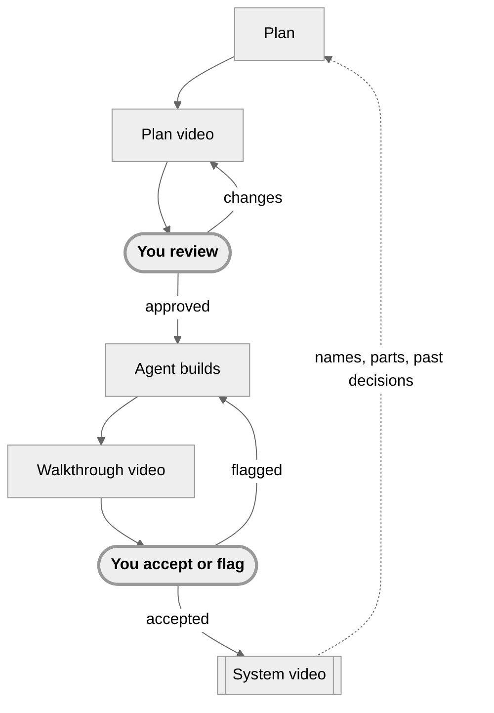

# Lifecycle: what is text, what is video, and when

## The rule

**Text is the record. Video is the review surface.** Every fact in a video is also in a text file the agent wrote (the plan, the decision ledger, the walkthrough report). The video carries the shape, the decisions and the deviations; the text carries the detail. Anything the reviewer must approve appears in both. A reviewer who never watches a video loses nothing except time.

## The full loop, in short

The README's three ways to use reelplanning are levels in the skill: **one video** (a plan video or an explainer,
nothing in the repo but `videos/<name>/`), **plus a walkthrough**, and **the whole pipeline**. What the whole
pipeline adds:

- **A plan video and its guide.** One-minute chapters: the problem, the parts it touches, each step on one
  diagram, each open question a choice with its trade-offs. The guide, a page built from the plan, sits
  under the video with the details.
- **The review page.** The video stops at each choice; you answer on the frame, add a note, mark or comment
  any moment, ask about a scene, look up a word, or turn the quick checks off to just watch. **Finish review**
  approves the plan or asks for changes; the agent rewrites only the steps you commented on, and you rewatch
  only what changed.
- **A decision log.** Your answers go into `.reelplanning/decisions.md`. The next plan has to cite the ones
  it relies on (`reel check`) and cannot quietly re-ask a settled question.
- **A walkthrough video.** After the build, about two minutes of the change running. It stops at the choices
  the agent made on its own that you would notice or cannot easily undo, and you accept or flag each. A
  second agent checks the code against the plan first.
- **A system video.** One video of the whole repo, rebuilt scene by scene as plans land. Send it to anyone new.

**How a run goes.** Leave out "quick" (`claude "/plan-to-video plan adding a dark mode toggle"`), or ask for a plan
the usual way: the skill loads for implementation plans. The first time, the agent asks which level and runs
`reel init`, which adds `.reelplanning/` to the repo (commit it). It writes the plan into
`.reelplanning/plans/<date>-<name>/`, checks it against past decisions, builds the video and opens the review
page. When you finish, it revises the plan, or builds it and comes back with the walkthrough (say "no
walkthrough" to skip that video for a plan). `reelplanning review` opens every plan and the system video in
one page; `reel status` says where each plan stands. How long the build takes depends mostly on the voice: one measured
build (8 October 2026, a 29-line plan video rebuilt with `reel rebuild` on a 4-CPU machine, hosted voice) took
4 min 53 s, 93 s of it the narration; the local voice takes longer, and `reelplanning setup` measures it on your
machine. Writing the plan, before the build, is the agent's own time. An MP4, if you ask for one, adds a few minutes.

**What it is made of.** Each scene is an HTML frame rendered with [HyperFrames](https://github.com/heygen-com/hyperframes);
[Kokoro](https://huggingface.co/hexgrad/Kokoro-82M) reads the script locally and
[whisper.cpp](https://github.com/ggml-org/whisper.cpp) times the captions; on a small machine, one OpenRouter key
does both in seconds a line ([narration engines](./reference.md#narration-engines)). Everything is text in
`.reelplanning/`, so every video can be rebuilt. With the local voice, reelplanning itself sends nothing about
your code anywhere; a hosted voice is sent the narration's lines.

## The stages

| Stage | Who | Text artefact (record) | Video artefact (review) | Reviewer action |
|---|---|---|---|---|
| 1 Plan | agent | `plan.md` (its steps, each with Cases, Interface and Example) | plan video: hook, tension, cast, steps, decision beats, resolved-plan ending | watch, decide, annotate |
| 2 Decide | reviewer, in the player | the review → `reviews/plan-<time>.json`, the choices in the ledger, and `reviews/plan-<time>.md` (what to act on: the steps to revise, with the reviewer's words) | the resolved-plan frame, rewritten live with the choices | approve, or send back |
| 3 Implement | agent | code, tests, and a `walkthrough.md` report: what was done per step, what deviated from the plan, what the agent decided on its own and why, evidence | none yet | none |
| 4 Walk through | agent | (the report) | walkthrough video: the change running, before and after, in about two minutes; it pauses on the choices you'd notice or can't easily undo, lists the rest at the end, and asks a quick check where there is something to predict | accept or flag each choice, answer the checks, annotate |
| 5 Review | reviewer | the review → `reviews/walkthrough-<time>.json`, accepted calls in the ledger (as history: a later plan hears of one only when its diff changes that call's lines), and `reviews/walkthrough-<time>.md` (the calls to fix, with the reviewer's words) | the same video, flagged beats listed | merge, or a fix list back to stage 3 |

All five stages run today, on this repo's own plans (`.reelplanning/plans/`): stage 3 ends with a second agent checking the diff against the plan (`code-check`, then `reel audit`), and a stage-5 flag goes back to stage 3 as a fix. After an accepted walkthrough, the system video is brought up to date. The small worked examples are `videos/l2-upload-resume` (stages 1–2) and `videos/w1-upload-resume` (stage 4, from the hand-written report `eval/plans/upload-resume/walkthrough.md`); [status](./status.md) says how far each part has been proved.

## Greenfield vs brownfield

| | Greenfield | Brownfield |
|---|---|---|
| What the viewer must learn | the shape of the thing being created | what exists today, then what changes |
| Cast beat | "the parts we will build" | "the parts that exist", with the ones that change marked |
| Tension beat | why the obvious build (a template, a single page) falls short | why the obvious change (a retry loop, a flag) breaks something that exists |
| Step beats | build order; each step adds a part | change order; each step shows before → after on one part |
| Decisions | scope and taste: stack, data source, design direction, what to leave out | risk and compatibility: where state lives, migration order, rollout |
| Risks beat | what we do not know yet | what could break that works today |
| Reference plans | `eval/plans/bob-dylan-site` | `eval/plans/upload-resume` |

## Knowledge levels (brownfield)

The same brownfield plan reads differently to three viewers. Rather than three videos, the storyboard tags each frame with the levels it serves and the player skips the rest, exactly as it skips unchosen branches.

| Level | Who | Includes | Skips |
|---|---|---|---|
| `new` | never saw this system | a "today" beat with the current architecture, the cast with one line each, why-not clauses, glossary tags | nothing |
| `familiar` | knows the component names, not the mechanics | the cast beat, why-not clauses | the "today" walkthrough of current behaviour |
| `owner` | wrote or maintains it | the change itself, the risks, the decisions | the "today" beat, the cast beat, standard why-nots |

Storyboard tag: `- knowledge: new,familiar` (frames with no tag serve every level). The player has a level selector; `plan-map.json` reports watched seconds per level. Greenfield plans do not use the toggle: everyone is `new` to a thing that does not exist.

## Walkthrough video (stage 4)

Built from `walkthrough.md`; the style guide's §8 has the rules. It shows the change running, not the plan again:

1. **Each change running, before and after**: on the real screen when you'd see it, or in a real run when it happens behind the page (the saved file before and after, a command's output).
2. **Pauses** for an off-plan change (always) and for a choice the agent made alone that you'd notice or can't easily undo, in the scene that shows it running. The player offers **Accept** / **Flag** on each; a flag is an annotation anchored to the step. `reel stops` says which choices pause and why.
3. **A quick check** just before a scene that runs something you could predict ("After the change, what does the saved file look like?"). Interpolated questions reduce mind-wandering and improve retention (`research.md` §1.2, Szpunar 2013); they also tell us which beats did not land.
4. **The ending**: what ran (tests, the code check), what is not done, every other choice as one list, each with its own Flag, and one open question: "Seeing it run, anything you'd change?"

## Where it all lives

Every artefact above lives in the target repo's `.reelplanning/` directory (`docs/project-dir.md`): the plan and its video under `plans/<date>-<slug>/`, the decisions in an append-only ledger, the parts and pipelines in `system.json`, the names in `glossary.md`, the look in `theme/`. The next plan starts from the ledger and the spec, cites what it keeps, and says what it changes. What it must cite are the rules: the owner's answers, or the `spec.md` section a part's rules were folded into (`reel fold`, on the owner's yes). The agent's accepted calls stay in the ledger as history; one comes back only when a diff changes the lines its commits wrote (`reel check --base`, `code-check`, `pr-check`), and `reel status` names the ones none of whose lines is left.

**Every version you reviewed can be built again.** Opening a video for review (`reelplanning review <video-dir>`) and
recording a review of it (`reel record`) keep that version: the commit its scenes are in, and the few files git leaves
out that nothing makes again (screenshots shown in scenes, the text the video was captured from), committed in
`.reelplanning/media/`. `reel rebuild <video-dir>` lists them; `reel rebuild <video-dir> --version 1` builds the first
again in a git worktree at its commit, with its plan, ledger, guide and screenshots as they were, and the voice made
again. The current video is not touched. What is kept and why: [project-dir.md](./project-dir.md#an-earlier-version-built-again).

## What stays text-only

- Whole diffs, file lists, migration SQL, config files.
- Full test output and logs.
- Anything the reviewer would copy.

The video shows a piece of the real thing only where the brief picks it (the one or two places of a diff that carry the idea, a command's real run: style guide §5); the whole of it is in the text and the guide.

## Several people

The stages above assume one person per repo, who plans, reviews and merges. In a shared repo
(`CONTRIBUTING.md`, from `templates/CONTRIBUTING.md`; the skill's "Several people"):

- **A pull request (PR) gets a video only over the line** (D-214, narrowed by D-223): the short walkthrough
  video, when it changes over 300 lines outside tests, docs, videos and generated files, the contributor
  ticks "makes a choice you'd notice or can't easily undo", or a maintainer adds `needs-video`. Under it, a
  normal code review; any other choice is a line under "Other choices" in the PR's text, which the
  maintainer accepts. A new flag alone is not a choice that needs one.
- **Who makes it** (D-200): a contributor who plans with reelplanning brings the plan video (reviewed by
  them before the code) and the walkthrough video; for one who doesn't, the maintainer's agent makes the
  walkthrough from the PR's diff and text.
- **Who decides** (D-201): the contributor's plan review answers the plan's questions; their walkthrough
  review is their own check and adds nothing to the ledger. The maintainer's walkthrough review is the one
  that counts. Main gets the plan, its final decisions, `walkthrough.md` and the maintainer's reviews; the
  contributor's reviews come off the branch before it merges (`reel pr-check --tidy`), and the merge is a merge
  commit: main keeps the PR's own commits.
- **Where the video lives** (D-213, D-215): the branch carries only the videos' text; the built video goes,
  packed, on a branch of its own, `video/pr-<n>`, never merged and deleted when the PR closes. The
  maintainer clones it and runs `reelplanning review` on it in the PR's checkout; `reel pr-check` checks
  that it was built from the plan as it is now, and the maintainer runs their own code check (D-202).
- **Records that merge** (D-171): decision ids stay in order; the PR merged second runs `reel renumber`
  at its rebase. `terms-index.json` is written again, never merged by hand.
- **What runs** (`.github/workflows/ci.yml`): the fast suite on every push; `reel pr-check` and `reel
  audit` on every PR; the full suite once a maintainer adds `ready-to-merge`, the check required before a
  merge; the video's branch deleted when the PR closes.
- **The system video** is brought up to date on main after merges, once for every PR merged since
  (D-003): `reelplanning spec-diff` names the frames, `reelplanning build .reelplanning/system-video`
  rebuilds them. `reel status` says it is behind meanwhile. A PR carries only the changes to `spec.md`,
  `system.json` and `glossary.md`: two PRs rebuilding one chapter would conflict in voice files git cannot
  merge.
